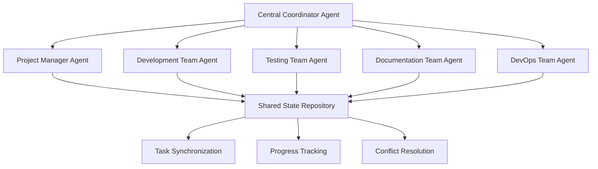
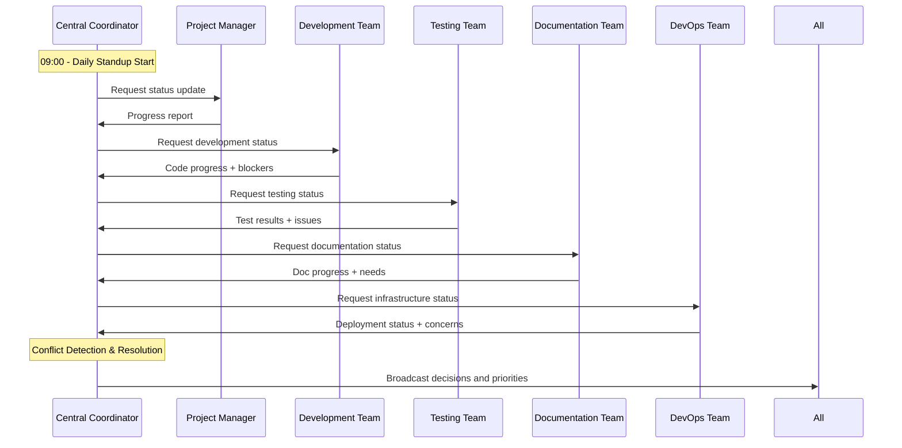

# Multi-Agent 協作架構設計
## Cursor 中的多智能體同步開發系統

### 🎯 目標
建立一個多 AI Agent 協作系統，讓不同角色的 AI 智能體能夠在 Cursor 中同時工作，並保持高度同步協調。

---

## 🏗️ 系統架構

### **核心協作機制**


---

## 📋 **1. 智能體角色定義**

### **🎯 Central Coordinator Agent (中央協調者)**
```yaml
責任:
  - 總體項目協調和衝突解決
  - 跨團隊任務分配和優先級管理
  - 進度同步和里程碑追蹤
  - 決策制定和資源分配

工作模式:
  - 每日站會主持 (Daily Standup)
  - 即時衝突調解
  - 週期性進度評估
  - 緊急事件響應
```

### **📊 Project Manager Agent (項目經理)**
```yaml
責任:
  - 項目進度追蹤和報告
  - 里程碑管理和風險識別
  - 資源分配和時程優化
  - 利害關係人溝通

專注檔案:
  - Qubic_AI_Compute_Layer_詳細任務清單.md
  - 項目進度報告
  - 風險評估文檔
  - 里程碑追蹤表
```

### **💻 Development Team Agent (開發團隊)**
```yaml
責任:
  - 程式碼開發和架構設計
  - 技術決策和實現路徑
  - 程式碼審查和品質控制
  - 技術債務管理

專注檔案:
  - src/ 目錄下所有程式碼
  - 技術設計文檔
  - API 規格文檔
  - 架構決策記錄 (ADR)
```

### **🧪 Testing Team Agent (測試團隊)**
```yaml
責任:
  - 測試計畫制定和執行
  - 品質保證和缺陷追蹤
  - 自動化測試開發
  - 性能和安全測試

專注檔案:
  - tests/ 目錄
  - 測試計畫和報告
  - 品質指標追蹤
  - 缺陷管理記錄
```

### **📚 Documentation Team Agent (文檔團隊)**
```yaml
責任:
  - 技術文檔撰寫和維護
  - 用戶指南和 API 文檔
  - 知識庫管理
  - 文檔品質控制

專注檔案:
  - docs/ 目錄
  - README.md
  - CHANGELOG.md
  - 所有 .md 檔案
```

### **🔧 DevOps Team Agent (運維團隊)**
```yaml
責任:
  - 部署和基礎設施管理
  - CI/CD 管道維護
  - 監控和告警系統
  - 安全和合規管理

專注檔案:
  - docker/
  - .github/workflows/
  - terraform/
  - kubernetes/
  - 部署腳本和配置
```

---

## 🔄 **2. 同步協作機制**

### **📊 共享狀態管理**
```typescript
// 共享狀態格式
interface ProjectState {
  timestamp: Date;
  currentSprint: number;
  activePhase: 'Phase1' | 'Phase2' | 'Phase3';
  
  // 各團隊狀態
  teams: {
    pm: TeamStatus;
    dev: TeamStatus;
    test: TeamStatus;
    doc: TeamStatus;
    ops: TeamStatus;
  };
  
  // 任務狀態
  tasks: Task[];
  
  // 阻塞和依賴
  blockers: Blocker[];
  dependencies: Dependency[];
  
  // 衝突和決議
  conflicts: Conflict[];
  decisions: Decision[];
}

interface TeamStatus {
  currentTasks: string[];
  completedTasks: string[];
  blockedTasks: string[];
  estimatedCompletion: Date;
  workingFiles: string[];
  lastUpdate: Date;
}
```

### **📝 同步協議檔案**
```yaml
# .cursor/multi-agent-sync.yml
sync_protocol:
  update_frequency: "5 minutes"
  conflict_resolution: "central_coordinator"
  priority_system: "weighted_priority"
  
communication_channels:
  - type: "shared_state_file"
    path: ".cursor/project-state.json"
  - type: "task_board"
    path: ".cursor/task-board.md"
  - type: "daily_standup"
    path: ".cursor/daily-standup.md"
  - type: "conflict_log"
    path: ".cursor/conflicts.md"

agent_workspaces:
  project_manager:
    files: ["**/任務清單.md", "**/進度報告.md"]
    priority: "high"
  
  development:
    files: ["src/**", "*.py", "*.js", "*.ts"]
    priority: "high"
  
  testing:
    files: ["tests/**", "**/test_*.py"]
    priority: "medium"
  
  documentation:
    files: ["docs/**", "*.md", "README*"]
    priority: "medium"
  
  devops:
    files: ["docker/**", ".github/**", "*.yml", "*.yaml"]
    priority: "low"
```

---

## 🔧 **3. Cursor 實現方案**

### **方案 A: 多窗口協作 (推薦)**
```bash
# 1. 主協調窗口
cursor --new-window /Users/apple/qubic/qdashboard
# 設置 Central Coordinator Agent

# 2. 項目管理窗口  
cursor --new-window /Users/apple/qubic/qdashboard --focus-files="**/任務清單.md,**/開發計畫.md"
# 設置 Project Manager Agent

# 3. 開發窗口
cursor --new-window /Users/apple/qubic/qdashboard --focus-files="src/**,*.py,*.js"
# 設置 Development Team Agent

# 4. 測試窗口
cursor --new-window /Users/apple/qubic/qdashboard --focus-files="tests/**"
# 設置 Testing Team Agent

# 5. 文檔窗口
cursor --new-window /Users/apple/qubic/qdashboard --focus-files="docs/**,*.md"
# 設置 Documentation Team Agent

# 6. 運維窗口
cursor --new-window /Users/apple/qubic/qdashboard --focus-files="docker/**,.github/**"
# 設置 DevOps Team Agent
```

### **方案 B: 單窗口分頁協作**
```bash
# 在同一個 Cursor 窗口中使用不同的工作區分頁
# 每個 Agent 對應一個專用的工作區配置
```

### **方案 C: VS Code 多實例 + 共享檔案系統**
```bash
# 每個 Agent 使用獨立的 VS Code 實例
# 通過檔案系統進行同步協作
```

---

## 📁 **4. 檔案結構設計**

### **協作控制目錄**
```
.cursor/
├── multi-agent-config/
│   ├── central-coordinator.json     # 中央協調者配置
│   ├── project-manager.json         # 項目經理配置  
│   ├── development-team.json        # 開發團隊配置
│   ├── testing-team.json           # 測試團隊配置
│   ├── documentation-team.json     # 文檔團隊配置
│   └── devops-team.json            # 運維團隊配置
├── shared-state/
│   ├── project-state.json          # 項目狀態
│   ├── task-board.md              # 任務看板
│   ├── daily-standup.md           # 每日站會記錄
│   ├── conflicts.md               # 衝突記錄
│   └── decisions.md               # 決策記錄
└── sync-protocols/
    ├── sync-config.yml             # 同步配置
    ├── conflict-resolution.yml     # 衝突解決規則
    └── communication-rules.yml     # 溝通規則
```

### **團隊專屬工作區**
```
workspaces/
├── pm-workspace/                   # 項目經理工作區
│   ├── progress-tracking/
│   ├── milestone-management/
│   └── risk-assessment/
├── dev-workspace/                  # 開發團隊工作區
│   ├── architecture/
│   ├── implementation/
│   └── code-review/
├── test-workspace/                 # 測試團隊工作區
│   ├── test-plans/
│   ├── automation/
│   └── quality-reports/
├── doc-workspace/                  # 文檔團隊工作區
│   ├── technical-docs/
│   ├── user-guides/
│   └── api-docs/
└── ops-workspace/                  # 運維團隊工作區
    ├── infrastructure/
    ├── deployment/
    └── monitoring/
```

---

## 🔄 **5. 同步流程設計**

### **每日同步流程**


### **即時同步機制**
```python
# 同步監控腳本
class AgentSyncMonitor:
    def __init__(self):
        self.state_file = ".cursor/shared-state/project-state.json"
        self.last_update = None
        
    def monitor_changes(self):
        """監控檔案變更並觸發同步"""
        while True:
            current_state = self.load_state()
            if current_state['timestamp'] != self.last_update:
                self.trigger_sync_event(current_state)
                self.last_update = current_state['timestamp']
            time.sleep(30)  # 30秒檢查一次
    
    def trigger_sync_event(self, state):
        """觸發同步事件通知所有 Agent"""
        for agent in state['active_agents']:
            self.notify_agent(agent, state)
    
    def resolve_conflicts(self, conflicts):
        """自動解決衝突或提報給協調者"""
        for conflict in conflicts:
            if conflict['severity'] == 'low':
                self.auto_resolve(conflict)
            else:
                self.escalate_to_coordinator(conflict)
```

---

## 🛠️ **6. 實際操作指南**

### **步驟 1: 環境準備**
```bash
# 1. 建立協作目錄結構
mkdir -p .cursor/{multi-agent-config,shared-state,sync-protocols}
mkdir -p workspaces/{pm,dev,test,doc,ops}-workspace

# 2. 初始化共享狀態檔案
echo '{"timestamp":"2025-01-20T00:00:00Z","teams":{},"tasks":[]}' > .cursor/shared-state/project-state.json

# 3. 建立同步配置
cp multi-agent-sync-template.yml .cursor/sync-protocols/sync-config.yml
```

### **步驟 2: Agent 配置**
```json
// .cursor/multi-agent-config/project-manager.json
{
  "role": "project_manager",
  "responsibilities": [
    "progress_tracking",
    "milestone_management", 
    "risk_assessment"
  ],
  "focus_files": [
    "**/任務清單.md",
    "**/開發計畫.md",
    "**/進度報告.md"
  ],
  "update_frequency": "hourly",
  "priority": "high",
  "dependencies": ["central_coordinator"],
  "communication_channels": ["task_board", "daily_standup"]
}
```

### **步驟 3: 啟動多 Agent 系統**
```bash
# 1. 啟動協調腳本
python .cursor/scripts/multi-agent-coordinator.py &

# 2. 開啟多個 Cursor 窗口
./scripts/launch-multi-agent-workspace.sh

# 3. 在每個窗口中設置對應的 Agent 角色
# (透過 Cursor 的 AI 設定或自定義指令)
```

### **步驟 4: 同步通訊設置**
```bash
# 建立共享任務看板
echo "# Multi-Agent Task Board\n\n## 今日任務\n\n## 進行中\n\n## 已完成\n\n## 阻塞" > .cursor/shared-state/task-board.md

# 建立每日站會模板
echo "# Daily Standup - $(date +%Y-%m-%d)\n\n## Project Manager\n- 昨日完成:\n- 今日計畫:\n- 阻塞問題:\n\n## Development Team\n...\n" > .cursor/shared-state/daily-standup.md
```

---

## 📊 **7. 監控和評估**

### **同步效率指標**
```yaml
metrics:
  sync_frequency: "每5分鐘"
  conflict_resolution_time: "<10分鐘"
  cross_team_communication: ">每小時1次"
  task_completion_rate: ">90%"
  
quality_indicators:
  code_consistency: ">95%"
  documentation_coverage: ">90%"
  test_coverage: ">85%"
  deployment_success_rate: ">99%"
```

### **協作品質評估**
```python
def evaluate_collaboration_quality():
    """評估多 Agent 協作品質"""
    metrics = {
        'sync_rate': calculate_sync_success_rate(),
        'conflict_resolution': measure_conflict_resolution_time(),
        'task_completion': track_cross_team_task_completion(),
        'communication_quality': assess_communication_effectiveness()
    }
    return generate_collaboration_report(metrics)
```

---

## 🎯 **8. 最佳實踐**

### **協作原則**
```yaml
principles:
  transparency: "所有決策和進度公開透明"
  autonomy: "各團隊在職責範圍內有決策自主權"
  collaboration: "優先考慮團隊協作而非個別效率"
  continuous_sync: "持續同步而非批次更新"
  
best_practices:
  - "每日至少同步3次狀態"
  - "衝突在24小時內解決"
  - "重要決策需要多團隊確認"
  - "文檔和程式碼同步更新"
  - "測試和開發並行進行"
```

### **常見問題處理**
```yaml
common_issues:
  file_conflicts:
    detection: "自動檔案變更監控"
    resolution: "merge 策略 + 人工確認"
    
  priority_conflicts:
    detection: "任務優先級分析"
    resolution: "協調者仲裁 + 影響評估"
    
  resource_conflicts:
    detection: "資源使用監控"
    resolution: "動態資源分配 + 隊列管理"
    
  communication_gaps:
    detection: "同步頻率監控"
    resolution: "強制同步點 + 告警機制"
```

---

## 🚀 **總結**

這個 Multi-Agent 協作架構設計提供了一個完整的解決方案，讓多個 AI Agent 能夠在 Cursor 中高效協作：

### **核心優勢**:
1. **🎯 角色清晰**: 每個 Agent 都有明確的職責和專注領域
2. **🔄 即時同步**: 5分鐘同步頻率確保資訊即時性  
3. **🛡️ 衝突處理**: 自動檢測和解決協作衝突
4. **📊 進度可視**: 共享任務看板和進度追蹤
5. **📚 知識共享**: 統一的文檔和決策記錄

### **實施建議**:
1. **先從簡單開始**: 先實施2-3個 Agent 協作，再逐步擴展
2. **建立清晰邊界**: 明確每個 Agent 的檔案和任務範圍
3. **定期評估優化**: 每週評估協作效果並調整策略
4. **保持人工監督**: 重要決策仍需人工確認

通過這個系統，您的 Qubic AI Compute Layer 項目將能夠實現真正的多智能體協同開發，大幅提升開發效率和品質！🎯
